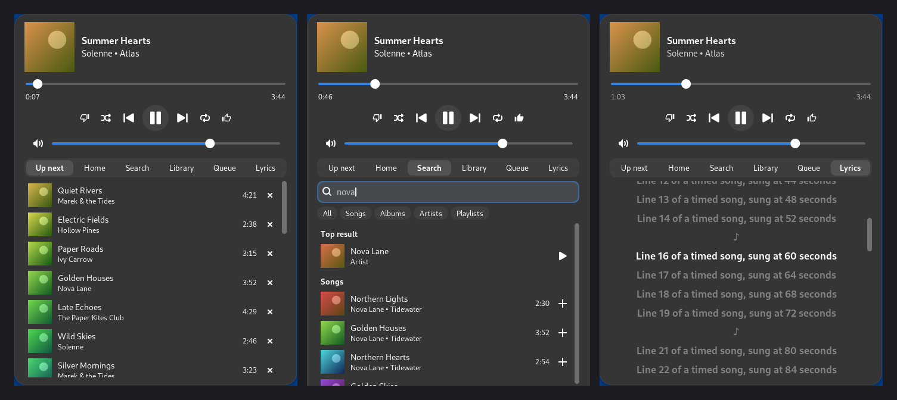

# YouTube Music Remote for GNOME

A top-bar remote for the [YouTube Music desktop app](https://github.com/pear-devs/pear-desktop) (pear-desktop) on GNOME Shell 45–50 (Ubuntu 24.04 LTS and newer, Fedora, Debian 13, Arch…).


<sub>Screenshots from the test setup, with made-up songs.</sub>

- **Now playing** in the top bar, and a popup with cover, seek bar, play/pause, next/previous, shuffle, repeat, like/dislike and volume.
- **Up next, Home, Search, Library, Queue** right in the popup: search with filters (songs, albums, artists, playlists), open albums, playlists and artists, play them or add songs to the queue, jump to or remove queue rows. Long lists load as you scroll.
- **Timed lyrics** from [LRCLIB](https://lrclib.net). The sung line lights up and stays in view, and you can click a line to jump there. When LRCLIB has nothing, YouTube Music's own lyrics are shown.
- **The app stays out of the way.** It starts in the background with no window (so it stays out of the dock) when you press play or open a tab, and quits after a pause (10 minutes by default). Play resumes the last song at the second you left it.
- Middle-click the remote to play or pause; scroll on it to change the volume. Click the cover to show or hide the app window.

This is a GNOME port of [omarchy-youtube-music](https://github.com/nicolasfalesy/omarchy-youtube-music) by nicolasfalesy, which does the same for the Omarchy (Hyprland) bar.

## Install

Unpack the archive (or clone the repository), then in that folder:

```bash
./install.sh --with-app     # also downloads and installs the pear-desktop .deb
# or: ./install.sh          # if you already have the app
```

Then:

1. **Log out and back in once.** On Wayland, GNOME only picks up a new extension after a new login.
2. **Sign in.** Right-click **YouTube Music** in the app menu (or the dock), choose **Sign in to Google**, sign in there, then quit the app. You only do this once. Google refuses to sign in ("This browser or app may not be secure") while the remote's debugging pipe is on, so this action starts the app without it (`tools/cdp-bridge --sign-in`). It quits a copy the remote started first. The login stays saved, so the remote can use the app normally afterwards.

The AppImage works too: choose it in the extension's settings (`gnome-extensions prefs ytmusic-remote@andrii`). The Flatpak build doesn't work, because Flatpak doesn't pass the private pipe through (see below).

To uninstall: `./install.sh --uninstall`.

## How it works

The remote needs the app's DevTools protocol to read the library, search, the queue and the real play state. The usual way, `--remote-debugging-port`, opens an unauthenticated TCP port that would give any local program full control of your signed-in account. So the port is never opened:

- `tools/cdp-bridge` starts the app with `--remote-debugging-pipe` and is the only holder of that pipe.
- It passes the pipe to the extension over a Unix socket in `$XDG_RUNTIME_DIR/ytmusic-remote/`. The folder is `0700`, the socket `0600`, and every connection's peer uid is checked.
- The installer's "YouTube Music" menu entry starts the app through the bridge too, so the remote can always reach it. If the app is started some other way, the remote can't control it until you quit it and start it again from the remote or the menu entry.

Inside the page, `lib/page.js` uses the signed-in page's own `networkManager.fetch` for search and browsing. It drives the player the same way pear-desktop's own renderer does. The page pushes state changes through a DevTools binding, so nothing is polled while music plays.

What goes where:

- The app: only the private socket described above.
- LRCLIB (`lrclib.net`): the song title, first artist, album and length, and only while the Lyrics tab is open.
- Cover images: fetched from YouTube's image servers and cached in `~/.cache/ytmusic-remote/`.
- The last song and position: saved in `~/.local/state/ytmusic-remote/last.json`.

The installer also turns off the app's own "resume on start", so the app never starts music by itself. The remote does the resuming instead.

## Development

- `dev/cdp-smoke.py` runs the bridge and page helper against `dev/mock/`, a stand-in YouTube Music page on a local server, with no network needed.
- `dev/start-shell.sh` starts a headless nested GNOME Shell with the extension and the mock app. Use `shot` and `ev` from `dev/shell-env.sh` to take screenshots and poke at it.
- `dev/build-page.py` regenerates `lib/page.js` from the original `Page.js` and `dev/player-helper.js`.
- `gjs -m dev/test-lyrics.js` runs the LRC parser checks.

## Коротко українською

Пульт для десктопного застосунку YouTube Music (pear-desktop) у верхній панелі GNOME: що зараз грає, керування, пошук, бібліотека, черга і синхронізовані тексти пісень. Застосунок працює у фоні лише тоді, коли він потрібен. Встановлення: `./install.sh --with-app`, потім вийдіть із сеансу й увійдіть знову, натисніть на обкладинку й увійдіть у YouTube Music.

## License

MIT; see [LICENSE](LICENSE). The page helper and the bridge come from omarchy-youtube-music (MIT, © nicolasfalesy). The like, dislike and note icons are based on Google's Material Icons (Apache 2.0).
